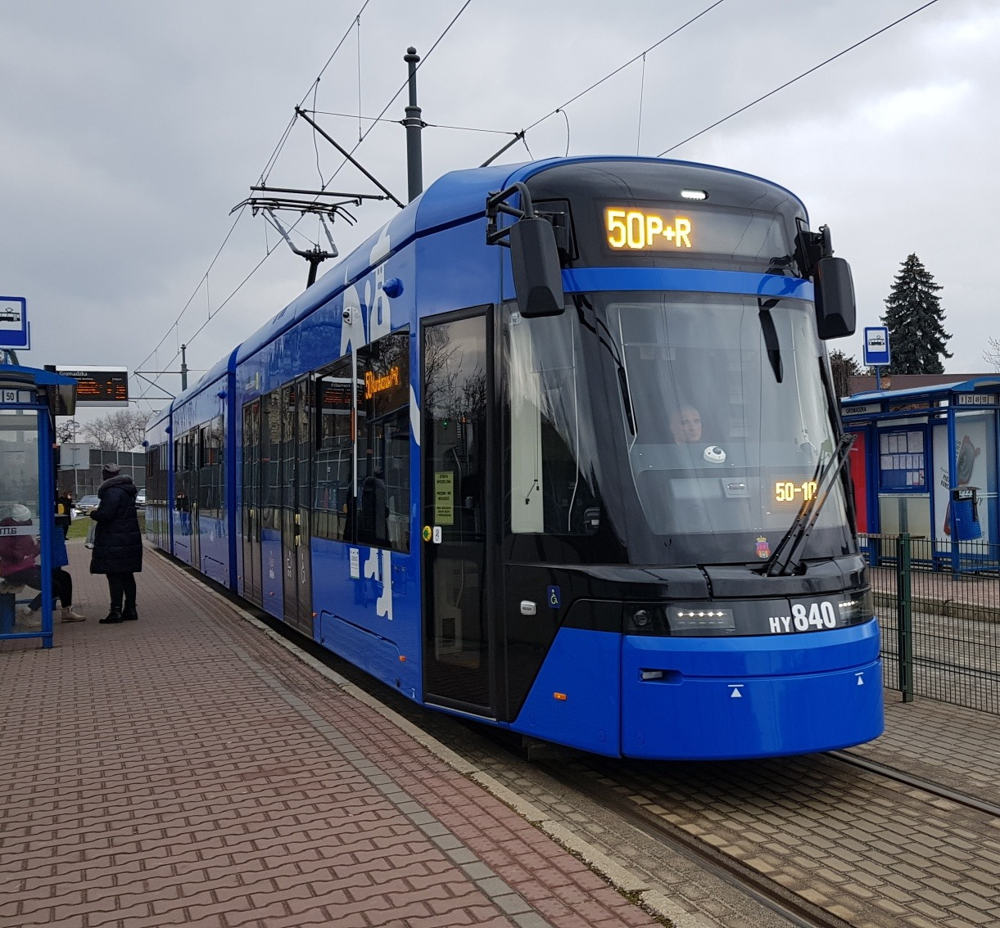

# PUBLIC TRANSPORT IN KRAKOW

## INTRODUCTION

#### LOL
>Krakow's public transport system relies on an extensive network of trams and buses, supplemented by local trains and private minibuses.

#### LOL2
>Trams are the most popular mode of transport, covering most of the city, while buses are ideal for reaching suburban areas.

#### LOL3
>Tickets are interchangeable between trams and buses within the same zone, and they can be purchased from machines at stops or onboard, as well as via mobile apps.

## DATA
#### This table contains info about the 4 most common tram lines.

| Tram Number | Tram Line | Common Time | Kilometers |
|-------------|-----------|-------------|------------|
|      5      |Krowodrza Górka P+R| 40 minutes | 20  |
|     18      |Górka Narodowa P+R| 38 minutes  | 23  |
|     3       |Krowodrza Górka P+R| 29 minutes | 27  |
|     50      |Górka Narodowa P+R| 30 minutes  | 25  |

## IMAGES

